# ChatSwitch法律小助手用户使用指南

本文面向普通使用者，说明如何创建知识库、配置模型和解析能力、上传文档、重新解析、下载文档，以及在对话中使用知识库引用。部署、并发和模型资源配置属于管理员工作，见 [部署说明](README.md)、[部署模板说明](deploy-template/README.md)、[并发配置说明](deploy-template/CONCURRENCY.md) 和 [法律知识图谱配置](legal-knowledge-graph-config.md)。

## 1. 新建知识库

进入「知识库」页面，点击标题右侧的绿色文件夹按钮创建知识库。


创建时先选「文档」类型，再按左侧配置项依次检查。模型配置、向量存储、解析引擎通常已经由管理员预置；图像处理、Wiki 知识库、知识图谱可以按资料用途开启或关闭。建议在创建阶段就想清楚这些开关，避免上传大量文档后再反复中断和重跑后台任务。

操作顺序：

1. 点击「新建知识库」。
2. 选择「文档」类型。
3. 填写知识库名称和描述。
4. 检查「模型配置」「向量存储」「解析引擎」是否已有默认值。
5. 如果需要自动生成 Wiki 页面，勾选「Wiki 知识库」。
6. 如果有扫描件或图片 PDF，进入「图像处理」开启多模态功能并选择 VLM 模型。
7. 如果需要实体关系分析，进入「知识图谱」开启实体关系提取。
8. 点击「创建知识库」。

建议按资料类型拆分知识库，例如「法律条文」「法律案例」「合同范本」。不同知识库可以分别配置是否启用图像识别、Wiki 和知识图谱。

## 2. 基本信息

新建或编辑知识库时，先填写「知识库名称」和「知识库描述」。左侧配置页用于切换不同能力的设置；红框里的模型、向量存储、解析引擎、图像处理、知识图谱都需要按知识库用途确认。

基本信息页下方的图标表示当前知识库启用的能力：

- 文件夹：文档数量。
- 图谱：实体关系抽取已启用。
- 图片：多模态图像识别已启用。
- 问号：问答知识库能力。
- Wiki 勾选项：开启后会在文档解析后自动生成 Wiki 页面。


保存配置后，知识库卡片会显示对应能力图标。若图标没有出现，返回设置检查对应功能是否已启用。


## 3. 模型配置

进入「模型配置」，选择当前知识库使用的默认 LLM 模型。问答、摘要、Wiki、图谱抽取等后台任务通常都会使用这里配置的主模型。


操作方法：点击模型下拉框，选择带「内置」「默认」标识的模型；如果列表为空或没有可用模型，点击「前往全局设置添加模型」让管理员先添加。保存知识库前必须保证默认模型已选好，否则后续问答和后台生成任务都会缺少模型。

使用建议：

- 普通知识库选择管理员配置好的默认模型。
- 如果有多个模型，优先选择带「默认」或「内置」标识的模型。
- 不要随意选择外部不可达模型，否则上传文档后的摘要、Wiki 或图谱任务可能失败。
- 扫描文档还需要在「图像处理」里配置 VLM 视觉模型，LLM 模型不能替代 VLM。

## 4. 知识图谱配置

进入「知识图谱」配置，可控制是否启用实体关系抽取。右上角开关打开后，新上传文档会在文字解析完成后继续抽取实体和关系；关闭后，新上传文档不会生成知识图谱。

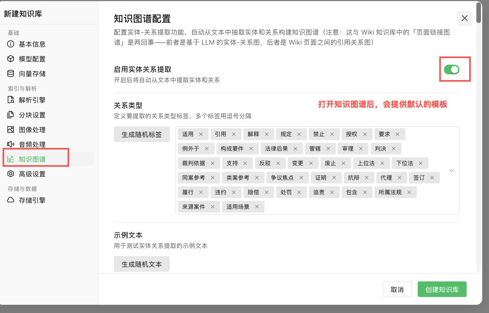

关系类型和示例文本用于指导模型抽取哪些实体、关系。页面上方可以维护关系类型标签，页面下方可以维护实体之间的管理关系。需要自定义模板时有两种方式：

- 手动添加：滚动到「管理关系」，点击「添加关系」，逐条选择「实体 A -> 关系 -> 实体 B」。
- 模板覆盖：点击「下载当前模板」，按模板格式修改后，再点击「上传模板」覆盖当前配置。

法律场景默认模板可参考 [法律知识图谱配置](legal-knowledge-graph-config.md)。


使用建议：

- 法律条文、判例、合同类知识库可以启用知识图谱。
- 只想做全文检索和问答的知识库可以关闭知识图谱，节省解析时间。
- 手动关闭知识图谱并保存后，正在进行或未开始的图谱任务会停止；已经抽取完成的图谱结果会保留。
- 修改关系类型或模板后，已完成的旧文档不会自动重跑；需要对相关文档执行「重建知识」。

文档完成图谱抽取后，进入知识库顶部「图谱」页查看关系图。可以搜索 Wiki 页面或节点，点击节点查看右侧详情；「展开邻居」会以当前节点为中心继续展开关系。图谱里不同颜色代表摘要、实体、概念、综合、对比等节点类型。


## 5. Wiki 配置

创建知识库时，如果需要自动生成互相关联的知识页面，需要在「基本信息」里勾选「Wiki 知识库」。开启后，系统会在文档文字解析后继续生成 Wiki 页面、摘要、分类和页面链接关系。

使用建议：

- 需要按主题浏览、沉淀知识页面时开启 Wiki。
- 只需要快速问答时可以关闭 Wiki。
- Wiki 生成比普通文字解析慢，上传大批文档时属于后处理阶段。
- 关闭 Wiki 后，未开始或进行中的 Wiki 任务会停止；已经生成的 Wiki 页面会保留。
- 重新打开 Wiki 后，新上传或重新解析的文档会继续生成 Wiki。

生成完成后，进入知识库顶部「Wiki」页查看。左侧是知识页目录和摘要数量，顶部可以搜索 Wiki 页面；点击页面标题后，中间区域展示模型生成的结构化内容，绿色文字是可跳转的内部链接。右侧「在图谱中查看」可以跳到图谱视图查看页面关系。


## 6. 向量存储配置

进入「向量存储」，选择 Embedding 模型。Embedding 负责检索召回，直接影响问答能否引用到正确文档。

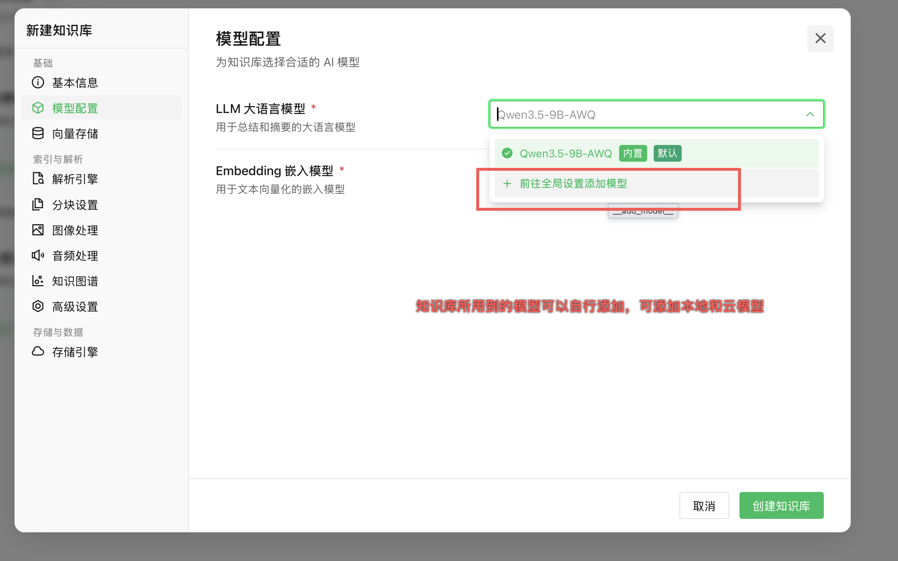

操作方法：点击 Embedding 模型下拉框，选择管理员预置的默认向量模型。这里配置的是检索模型，不是聊天模型；上传文档后，系统会用它把文档分块写入向量索引。

使用建议：

- 优先使用管理员预置的默认 Embedding 模型。
- 不要把 Embedding 模型和聊天模型混用。
- 如果对话提示「加载模型列表失败」或检索不到文档，先检查这里是否有可用模型。

## 7. 解析配置

「解析引擎」「分块设置」「图像处理」「音频处理」决定文档如何入库。

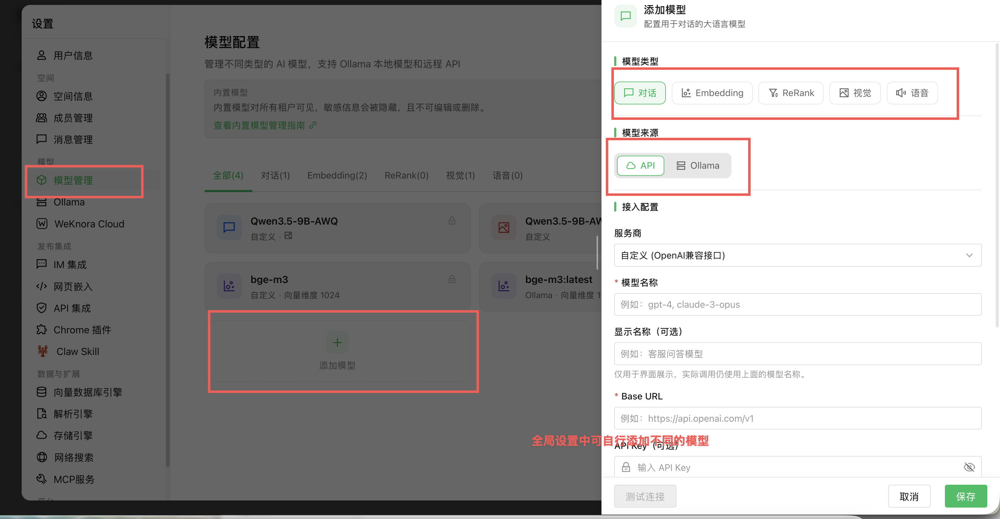

操作方法：普通文本 PDF、DOCX、TXT 保持默认解析引擎和分块设置即可；需要调整分块时，优先改分块大小和重叠长度，不要同时改多项。上传前确认图像处理和知识图谱是否需要开启，避免任务排队混乱。

常用配置：

- 文档解析：负责提取文字内容。
- 分块设置：控制文档切分粒度，普通问答保持默认即可。
- 图像处理：扫描件、图片 PDF 需要开启多模态识别。
- 音频处理：只有上传音频资料时才需要配置。

如果 PDF 是扫描件，必须开启「图像处理」里的多模态功能，否则系统可能只能看到空白或乱码文本。

图像处理页打开「多模态功能」后，需要选择 VLM 视觉模型。系统通常会提供默认 VLM 模型，直接选择带「默认」或「内置」标识的模型即可。该设置只影响图片、扫描件和无法直接抽取文字的 PDF，不会替代普通文字解析。

## 8. Ollama 配置

如果管理员部署了 Ollama 备用模型，可以在「Ollama 配置」里查看服务地址和可下载模型。

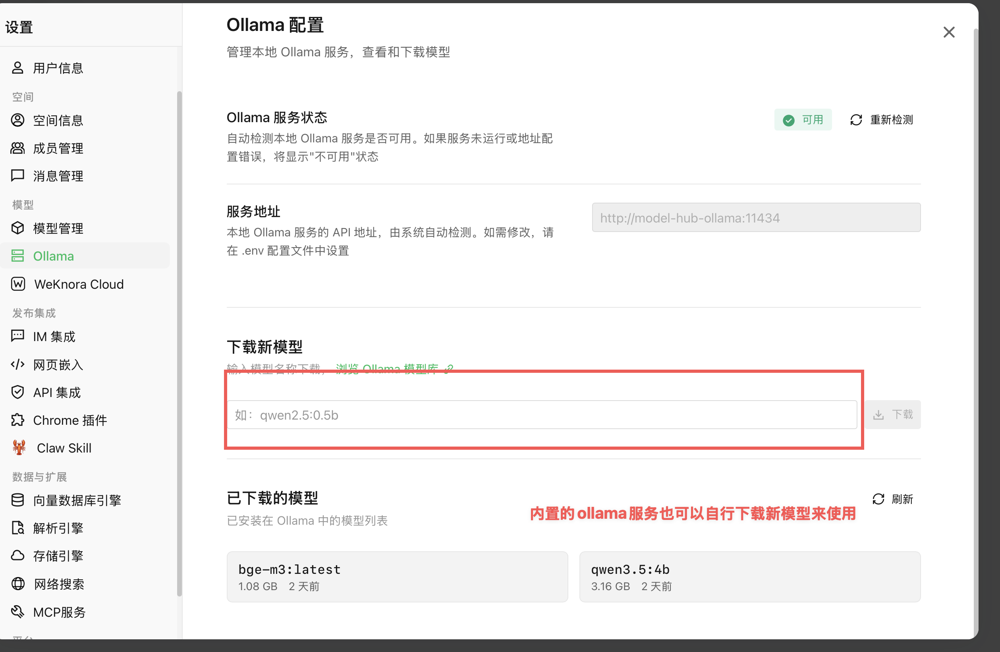

操作方法：普通用户一般不需要手动修改这里。只有管理员要求下载备用模型时，才在「下载新模型」里输入模型名称并点击下载。模型是否常驻、是否使用 GPU，由管理员按 [部署模板说明](deploy-template/README.md) 和 [并发配置说明](deploy-template/CONCURRENCY.md) 配置。

## 9. 上传和管理文档

进入某个知识库后，切到「文档」页，可以上传文件、搜索、按标签/类型/状态筛选。


操作方法：点击上传按钮或拖拽文件到页面上传；用搜索框按文件名过滤；用「全部标签」「全部类型」「全部状态」「全部来源」缩小范围。文件上传后先进入文字解析，再进入摘要、Wiki、图谱等后处理。

文档卡片状态说明：

- 文档解析中：正在提取文字、切分、向量化。
- 生成摘要中 / 优化中：文字已入库，正在进行摘要、Wiki、图谱等后处理。
- 解析失败：任务停止，需要重新解析。
- 已完成：当前启用的解析能力已完成。

## 10. 文档管理、重析和 Trace

文档卡片右上角菜单是单个文档的操作入口，可以查看 Trace、重建知识、停止解析、移动、批量管理或删除文档。Trace 用于查看这个文档每个处理阶段是否成功，重建知识用于按当前知识库配置重新解析该文档。

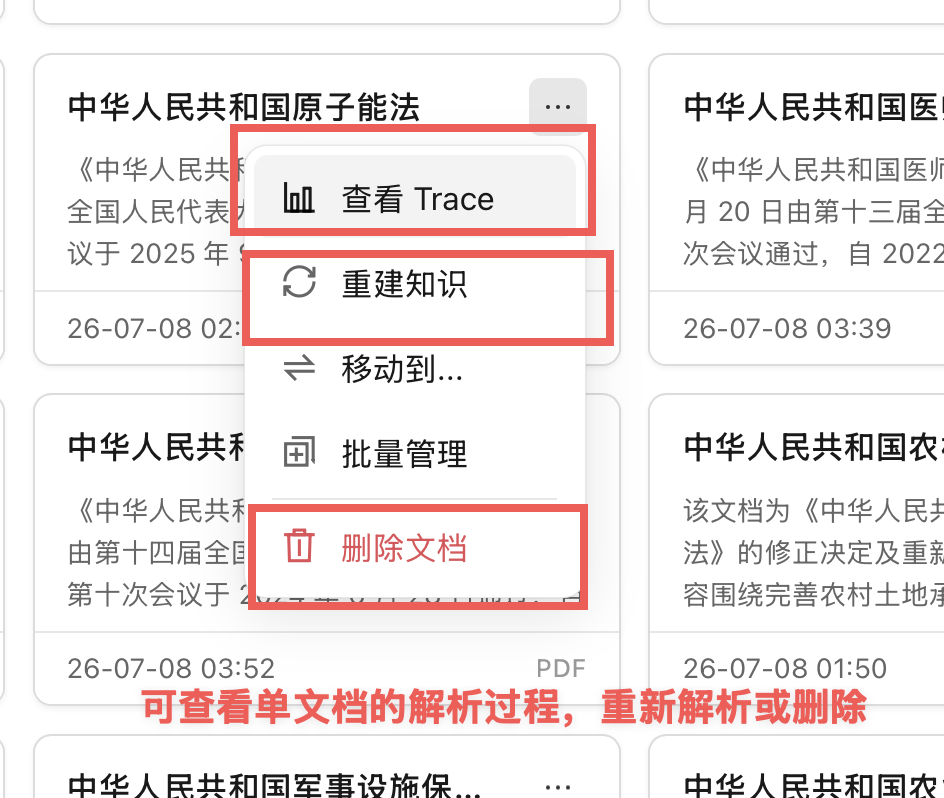

文档页顶部提供「重新解析失败文档」按钮，用于把当前知识库中明确失败且已停止的文档，按知识库当前默认配置重新入队；「下载当前知识库文档」用于一次性下载当前知识库内的源文件。


单个文档点击「重建知识」后，会打开重新解析确认窗口。这里会沿用该文档上次解析时的配置，也可以只针对这一次重析单独调整：

- 解析引擎和分块：控制这份文档如何重新提取文字、切分和入库。
- 多模态：控制这份文档本次是否重新触发图片、扫描件识别；关闭后，本次重析不会跑图片解析。
- 图谱：控制这份文档本次是否重新触发实体关系抽取；关闭后，本次重析不会跑知识图谱。
- 问题生成：控制是否重新生成推荐问题。

确认后，系统会按弹窗里的配置重跑这一个文档；这些配置会保存到该文档，后续再次重析时默认沿用。


选中文档后，底部会出现批量操作栏：

- 重建知识：重新解析选中文档。
- 下载选中文档：下载选中文档的源文件。
- 批量删除：删除选中文档。

点击「查看 Trace」后，可以看到文档处理流水线，用于判断失败发生在哪个阶段。

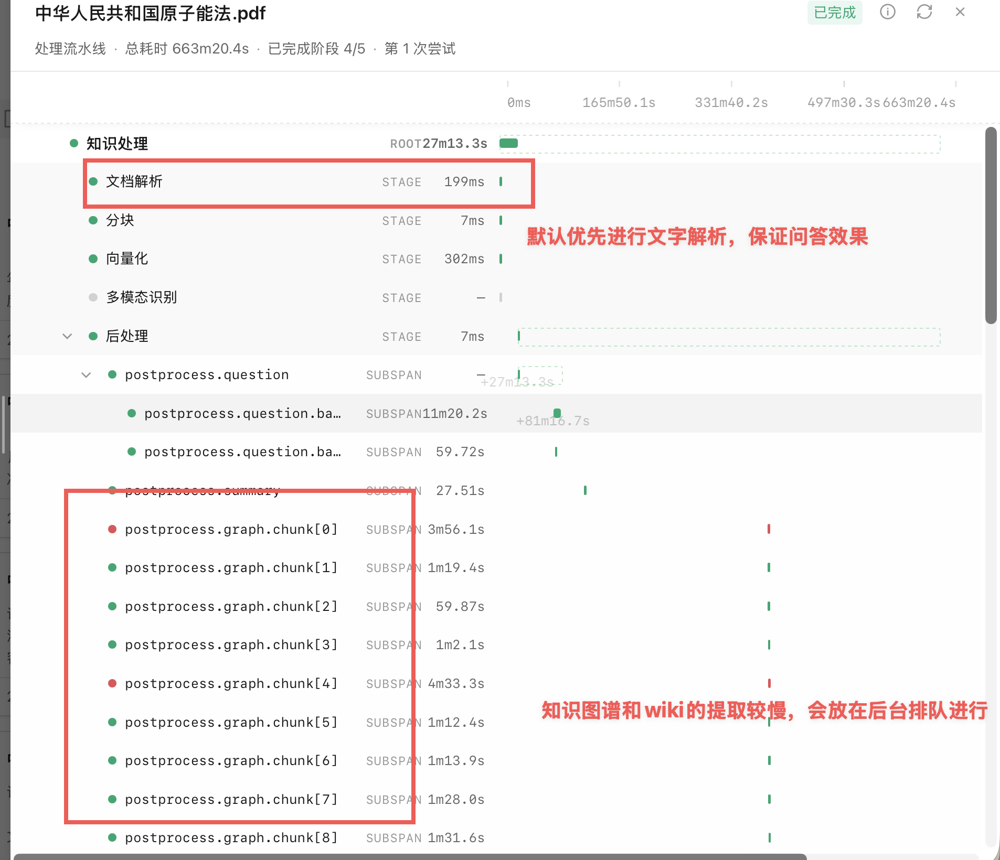

操作方法：在文档卡片右上角菜单点击「查看 Trace」，展开失败或耗时较长的阶段。红色节点表示失败，橙色或长条通常表示仍在运行或耗时较久；如果失败发生在 Wiki、Graph 或多模态阶段，文字检索可能已经可用。

常见阶段：

- 文档解析：提取原始文字。
- 分块：切分成可检索片段。
- 向量化：生成 Embedding。
- 多模态识别：识别扫描件或图片内容。
- postprocess.question：生成问题。
- postprocess.wiki：生成 Wiki。
- postprocess.graph：生成知识图谱。

如果只有 Wiki、Graph 或多模态失败，问答可能仍可使用已经完成的文字内容。

## 11. 快速问答

回到对话页面，选择知识库后提问。底部模型选择器应使用管理员配置好的默认模型；普通用户无需每次手动切换。

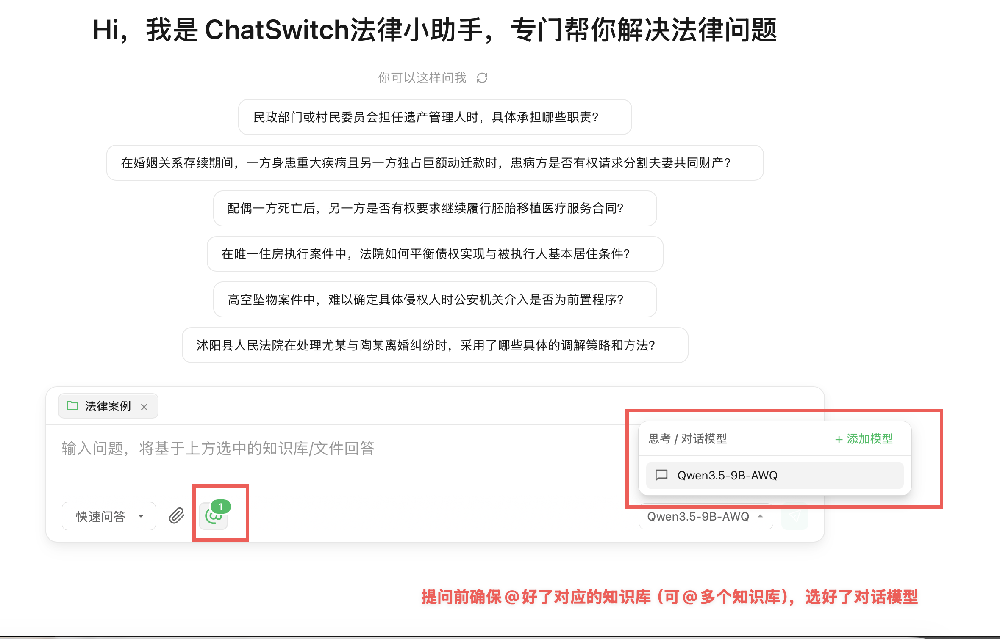

操作方法：在输入框上方选择要使用的知识库或文件范围，确认右下角模型为默认模型，然后输入问题发送。提问时尽量写清具体法律问题、合同条款或文件范围，系统会先检索文档，再组织回答。

如果回答前显示「正在理解问题」或「检索知识库」，表示系统正在做检索、Embedding 或引用准备，不是模型思考内容。

## 12. 合同审查智能体

合同审查可以用「快速问答」或「智能推理」两种方式。单份合同审查、条款定位、风险点识别通常先用快速问答；需要工具调用、复杂步骤规划、图谱/Wiki 辅助分析或内置合同审查 Skill 时，再使用智能推理。

当前系统内置了两类合同审查配置：

- 快速问答模板：`合同审查问答`，用于基于检索到的合同、法律条文、模板或案例快速输出风险、依据和修改建议。
- 智能推理智能体：`合同审查`，使用 `contract-review` Skill，适合输出审查报告、逐条审查、修改文本、增量版本对比、签章主体核验等结构化任务。

### 12.1 快速问答模式

操作方法：

1. 进入「智能体」，创建合同审查智能体。

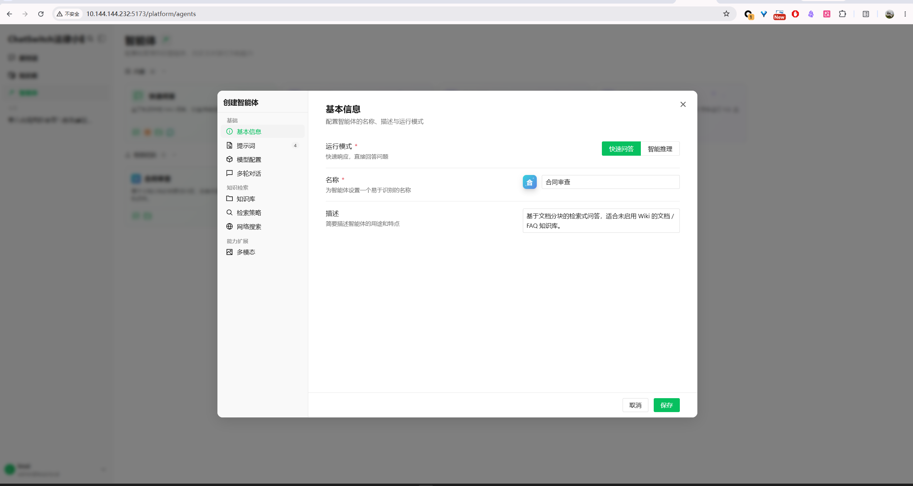

2. 运行模式选择「快速问答」。
3. 在提示词模板中选择「合同审查问答」或合同审查模板。

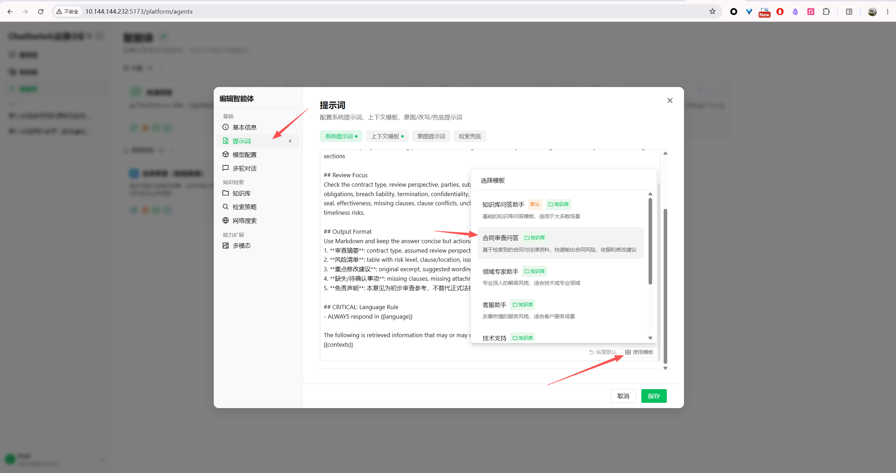

4. 指定用于合同审查的知识库，例如合同模板库、法律条文库或项目合同库。

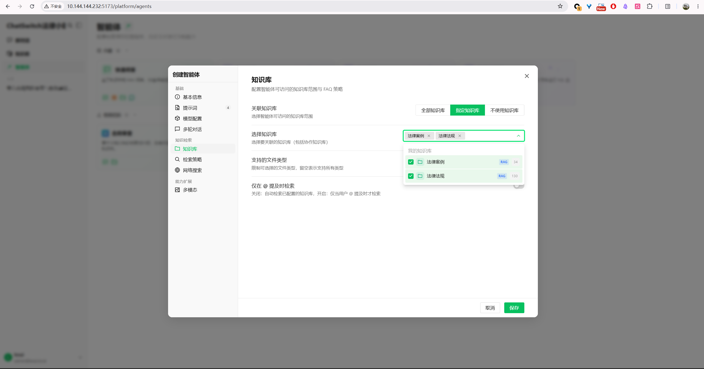

5. 如果需要把审查流程固定下来，可以在工作流或技能配置里继续选择合同审查相关配置。

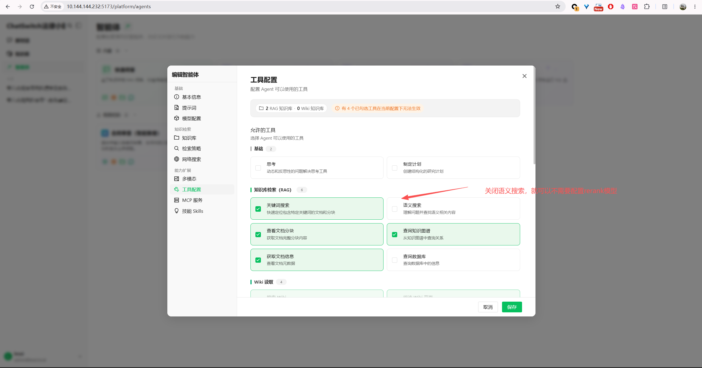

6. 保存智能体后，选择该智能体开始会话。
7. 在输入框里上传或选择要审查的合同，并说明审查立场和输出格式。

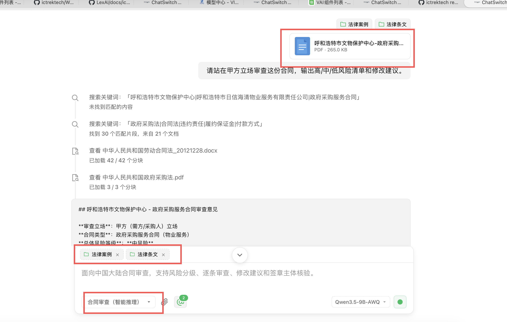

输入框上方的知识库标签用于限定检索范围。合同审查时通常同时选择「法律条文」和「法律案例」等基础知识库，再上传本次要审查的合同文件。左下角的模式选择器用于选择合同审查能力，例如「合同审查（智能推理）」；附件卡片显示本次上传的合同，模型会把该合同作为本轮审查对象。

Prompt 示例：

```text
请站在甲方立场审查这份合同，输出高/中/低风险清单和修改建议。
```

快速问答模式适合直接审查单份合同。默认可以不开启 Wiki 和知识图谱，优先保证向量检索、关键词检索和引用来源准确。

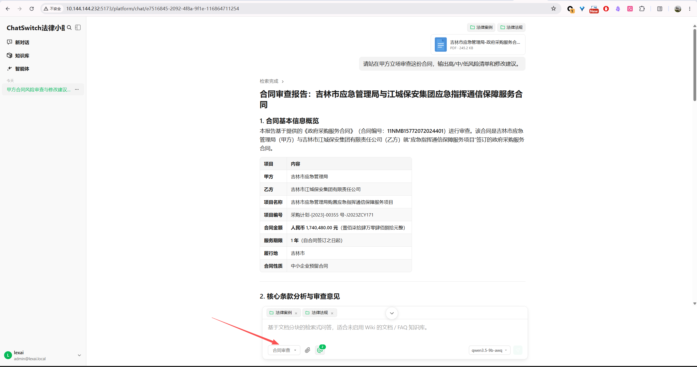

### 12.2 智能推理模式

操作方法：

1. 创建智能体时选择「智能推理」运行模式。

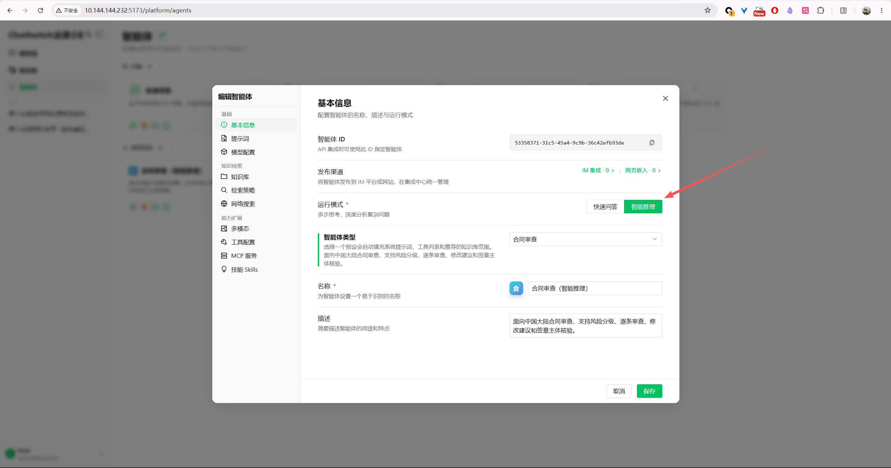

2. 智能体类型选择「合同审查」。

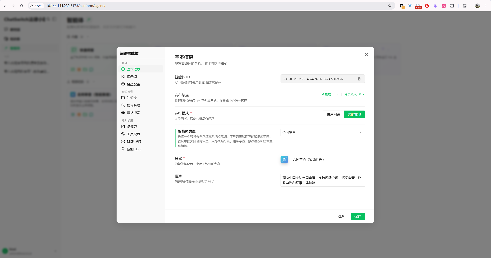

3. 指定合同审查要使用的知识库。


4. 如果当前环境没有配置 rerank 模型，可以关闭「语义搜索」，避免因为缺少 rerank 模型导致配置不可用。


5. 在工具或 Skill 配置中选择 `contract-review` 合同审查 Skill；内置「合同审查」智能体默认已选择该 Skill。

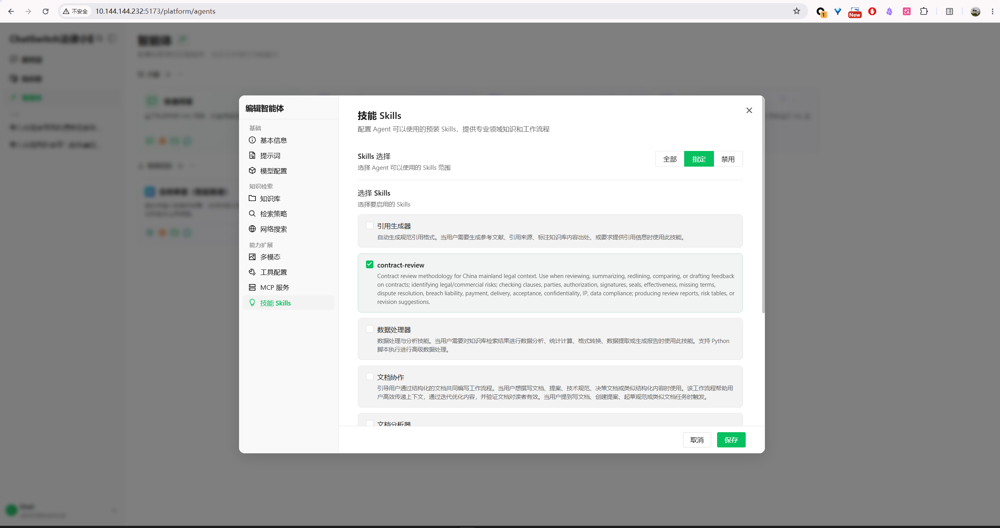

6. 如果需要调用法律法规查询工具，可以在工具配置中启用 `gov-law`，让智能体按需检索公开法律法规来源。

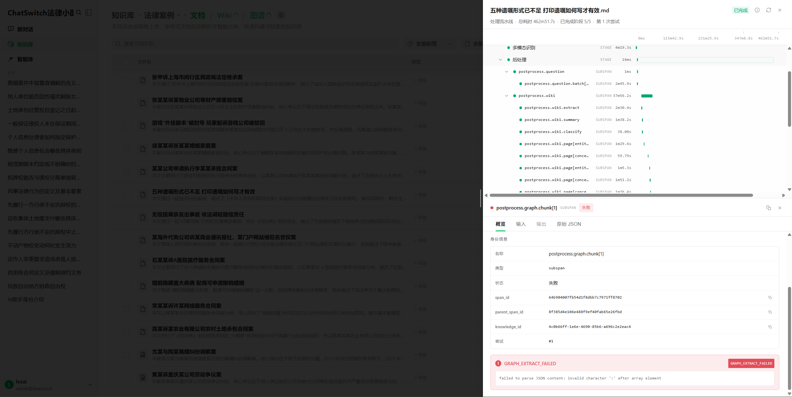

`gov-law` 工具用于访问公开法律法规数据源，适合补充查法条、查最近法规和核对依据；合同原文、模板、公司制度仍然优先放入知识库检索。

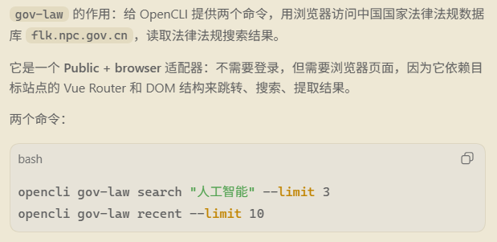

7. 保存后，选择该合同审查智能体开始会话。

智能推理模式适合多步骤审查，例如先识别合同主体、义务、期限、违约责任和争议解决条款，再输出风险分级和修改建议。管理员需要确保后端模型服务支持工具调用解析；如果模型服务不支持自动工具调用，优先使用快速问答模式。

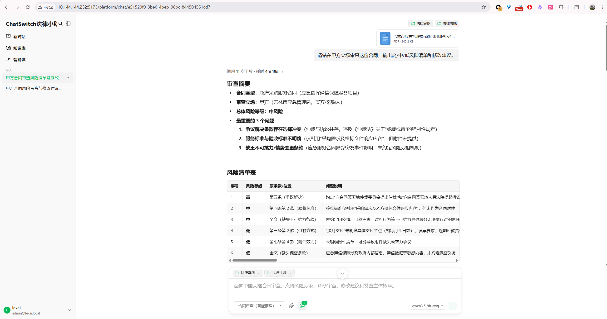

智能推理模式会先根据合同名称、合同类型、审查任务和用户立场生成检索关键词，再查看相关法律条文、案例或模板材料。过程面板中的「搜索关键词」表示系统正在找依据；「查看文档」表示系统已加载命中的知识分块。若某个关键词没有匹配内容，后续关键词仍会继续检索，不代表审查失败。


审查结果页会展示模型回答、引用材料和工具调用过程。用户应先查看风险结论，再展开引用来源核对原文依据。

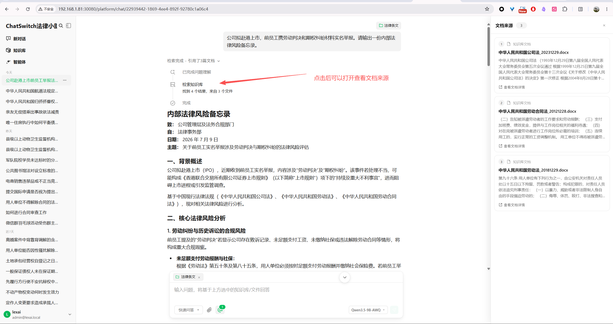

如果智能体输出了审查报告，可以继续追问某一类风险、要求按条款编号重写，或让它生成可复制的修改文本。

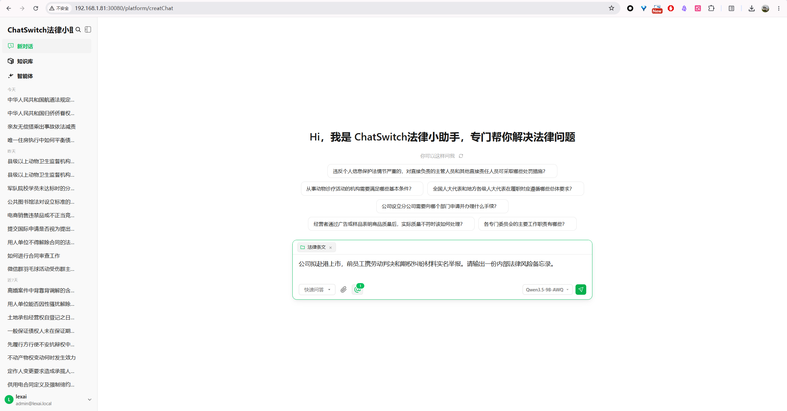

完整合同审查报告通常包括审查结论、总体风险等级、风险清单、重点条款修改、缺失条款建议和待确认事项。用户可以先阅读风险清单定位高/中风险条款，再看「原文摘录、建议文本、修改理由」三列内容，确认建议是否符合本次交易立场。


内置合同审查智能体会按以下流程工作：

1. 识别合同类型、交易背景、审查立场、准据法和争议解决地。
2. 检索并阅读合同原文、法律法规、公司制度、模板或案例。
3. 按任务类型进入总审查、逐条审查、修改建议、版本增量审查或签章主体审查。
4. 按高/中/低风险说明触发原因、可能后果、依据和修改建议。
5. 资料不足时明确写「现有资料不足，无法判断」，并列出需要补充的附件、授权、主体信息或业务事实。

常用输出要求：

- 总体审查：要求输出「审查摘要、风险清单、重点条款修改、缺失条款建议、待确认事项、免责声明」。
- 逐条审查：要求按条款输出「通过 / 需修改 / 高风险 / 无法判断」。
- 修改建议：要求输出可直接替换的合同文本，并标注是否改变商业实质。
- 版本对比：要求只审查新旧版本之间的实质性不利变化。
- 签章主体核验：要求检查主体资格、授权代表、签章方式、生效条件和附件缺失。

## 13. 微信 / IM 访问知识库

管理员可以在通用设置里添加 IM 集成，让用户通过企业微信、飞书、Slack、Telegram、钉钉、Mattermost、微信或 QQBot 等 IM 应用访问知识库。


操作方法：

1. 进入系统设置。
2. 在左侧选择「IM 集成」。
3. 点击「添加渠道」。
4. 在「绑定智能体」里选择要开放给 IM 使用的智能体，例如「快速问答」。
5. 在「平台」里选择企业微信、飞书、微信等具体渠道。
6. 继续完成连接设置、文件存储、平台凭证配置。
7. 保存后，用户即可在对应 IM 应用中通过机器人访问绑定的知识库。

IM 集成是让外部聊天工具访问知识库，不影响知识库的文档解析、图像处理、Wiki 或知识图谱配置。

## 14. 查看引用来源

回答完成后，正文上方会显示「检索完成 · 引用了 N 篇文档」。点击该区域可展开引用来源。


操作方法：点击「检索完成 · 引用了 N 篇文档」展开右侧「文档来源」面板，再点击具体来源查看命中的原文片段。若看到乱码或内容明显不对，通常是原文档文字层异常或扫描件没有完成多模态识别，需要回到文档页查看 Trace 并重新解析。

## 15. 检测系统更新

知识库列表页右上角提供「检测更新」按钮。普通使用者可以点击该按钮检查当前部署是否有新版本；系统会只检测当前部署需要替换的 ChatSwitch 镜像，不会因为没有镜像更新而拉取或替换部署配置。

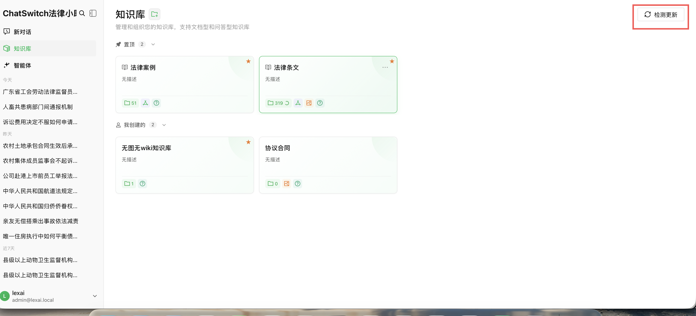

操作方法：

1. 点击右上角「检测更新」。
2. 如果没有可用更新，页面会提示当前已是最新版本。
3. 如果发现更新，弹窗会列出当前版本、可更新版本和将被替换的服务。
4. 确认更新后，系统会在后台拉取新镜像并替换服务；弹窗会显示更新日志和拉取进度。
5. 如果前端或后端服务被替换，页面可能短暂不可用；等待几分钟后手动刷新页面。

更新过程中不要重复点击按钮。若页面提示网络错误，通常是服务正在重启；稍后刷新页面即可。若长时间无法恢复，联系管理员查看部署目录中的 `update-and-deploy.log`。

## 16. 系统资源与任务队列

管理员可以在「系统设置」和「任务队列」里查看后台解析资源是否足够。这里的参数会影响文档解析、扫描件识别、摘要、Wiki、知识图谱和问题生成的速度；在线聊天是否流畅，还取决于部署侧给 QA 模型预留的槽位，详细部署规则见 [并发配置说明](deploy-template/CONCURRENCY.md)。

### 16.1 系统设置里的并发参数

进入「全部设置 / 系统设置」后，可以看到后台 worker 池的每实例并发数。带「需重启」标识的参数，保存后需要重启后端服务才会生效。


各参数含义如下：

- 核心解析保底并发数：控制文档解析和手工重解析的基础 worker 数。它负责文字抽取、分块、向量化等让文档先变成可检索内容的阶段。数值过低会导致新上传文档长时间停在解析队列；数值过高会增加 docreader、Embedding 和数据库写入压力。
- 内容富化保底并发数：控制摘要、图片/扫描件识别、知识图谱、问题生成等增强任务的基础 worker 数。它不应该高于机器实际模型余量，否则容易让后台任务抢占聊天模型。
- 维护与同步并发数：控制数据源同步、批处理、清理、批量重解析、批量删除等维护任务的基础 worker 数。通常保持较低，避免维护任务影响用户前台操作。
- 后处理编排并发数：控制文档文字解析完成后的轻量收尾和富化任务派发。它负责把已解析文档继续转入摘要、Wiki、图谱等后续阶段。
- 共享弹性并发数：核心解析和内容富化共同借用的弹性 worker 数。有积压的一侧可以自动借用，但小机器建议设为 `0`，避免富化任务绕过明确限流。
- Wiki Worker 并发数：控制 Wiki 内容生成和全局收尾的专用 worker 数。Wiki 有独立队列，不占核心解析 worker；真正调用主 QA 模型时仍会受后台模型总并发限制。

设置建议：

1. 优先保证「核心解析」足够，让文档先完成文字解析、分块和向量化。
2. 内容富化、Wiki、知识图谱可以慢慢补，不要为了加速它们把聊天模型占满。
3. 共享弹性池只适合资源较充足的机器；如果发现聊天变慢或后台互相挤占，先把共享弹性并发数降为 `0`。
4. 修改这些参数后，等待服务重启完成，再到「任务队列」确认新容量是否生效。

### 16.2 任务队列运行时

「任务队列」页面展示当前后台任务负载、各 worker 池占用、队列明细和模型并发占用。它用于判断任务是真的在运行、只是排队，还是已经失败。


页面上方「运行概览」的指标含义：

- 运行中：当前正在执行的后台任务数量。
- 排队中：等待 worker 处理的任务数量。排队多不一定是异常，要结合队列类型和最早等待时间判断。
- 重试中：失败后等待重试的任务数量。
- 死信：超过重试次数后停止的任务数量，需要管理员查看原因或重新触发解析。

「Worker 池」卡片显示每类 worker 的占用情况，例如 `2/2` 表示该池 2 个实例都在工作，`0/4` 表示 4 个容量都空闲。卡片里的说明包括「单实例配置」和「集群运行中/容量」：

- 单实例配置：每个后端服务实例配置的 worker 数。
- 集群运行中/容量：当前所有 app 实例合计正在运行的任务数和总容量。
- 利用率：该池当前占用比例。长期 100% 说明该阶段是瓶颈。
- 队列数：该池绑定的待处理队列数量。

「队列明细」逐行展示具体队列。常见队列包括：

- 默认（文档解析）：文档解析、分块、向量化和手工重解析，属于核心解析。
- 后处理编排：文字解析完成后的状态收尾和富化任务派发。
- 摘要生成：文档摘要和表格摘要。
- 多模态（图片）：扫描件、图片 PDF、图片内容理解。
- 图谱抽取：实体关系抽取和知识图谱构建。
- 问题生成：基于文档分块生成推荐问题。
- 数据源同步：手动或定时数据源同步。
- 后台维护与批处理：FAQ 导入、复制移动、批量重解析、批量删除和清理任务。
- Wiki 同步：Wiki 内容生成和索引同步。

队列表格里的「运行中 / 排队 / 重试 / 死信 / 最早等待」用于定位瓶颈：如果「默认（文档解析）」长期排队，说明文字解析没有足够 worker；如果「图谱抽取」或「Wiki 同步」排队很多，但聊天正常，可以让它们慢慢处理；如果死信持续增加，需要打开 Trace 或后台日志查失败原因。

「模型并发占用」展示后台任务进入模型服务后的占用情况。这里和 worker 池不同：worker 是任务调度容量，模型并发是进入 vLLM / Embedding 服务后的实际模型请求容量。后台任务池很多时，也必须通过模型并发限制给在线聊天留出槽位。

## 17. 配置建议

按法律场景选择功能。默认先保证文字解析、向量化和检索可用；Wiki、知识图谱属于增强能力，只有确实需要跨文档关系、实体关系或长期知识沉淀时再开启。法律条文库这类内容变动较慢、概念和条文关系稳定的知识库，建议开启 Wiki 和知识图谱；合同审查、单案材料、文书生成等高频上传资料，通常先不开启，等资料规模和关系分析需求明确后再开启。

| 法律场景 | 默认是否开启 Wiki / 知识图谱 | 推荐索引策略 | 可不开启的典型情况 | 建议开启的典型情况 |
| --- | --- | --- | --- | --- |
| 法律条文库 | 建议开启 | Vector Search + Keyword Search / BM25 + Wiki + KG | 只查单条法条原文、只做简单条文问答 | 法律条文变动不大，适合长期沉淀；需要按法律概念、法条、上位法/下位法、适用场景、裁判规则建立稳定关系 |
| 合同审查 | 不开启 | Vector Search + Keyword Search / BM25 | 单份合同审查、条款定位、风险点识别、违约责任/解除条款/责任上限查询 | 大型合同库、多主体、多项目，需要分析「主体-义务-期限-责任-担保-争议解决」关系 |
| 隐私政策 / 数据合规 | 不开启 | RAG + 关键词检索 + 合规清单 | 单份隐私政策、App 隐私声明、DPA 审查、条款缺失检测 | 企业级合规知识库，需要关联法规、系统、数据类型、处理目的、第三方供应商 |
| 案件材料整理 | 多数不开启，复杂案件建议开启 | RAG + 文档标签/元数据 | 单案材料分类、摘要、证据出处查找、时间线初步整理 | 复杂案件、多当事人、多证据、多时间线，需要构建「人-公司-事件-证据-法律关系」 |
| 法律文书生成 | 通常不开启 | RAG + 模板 + 事实材料检索 | 起诉状、答辩状、律师函、审查报告、法律备忘录初稿生成 | 多案复用、类案规则沉淀、长期维护文书知识体系时可考虑 |
| 法律知识问答 | 普通问答不开启，研究库建议开启 | Vector Search + Keyword Search / BM25 | 法规 FAQ、制度问答、常见法律问题解释、查找法条原文 | 法律研究库、类案检索、跨法规比较，需要「法律概念-法条-案例-裁判规则」关系 |
| 通用判断规则 | 先不开启，按需开启 | 初期：Vector + Keyword；复杂场景：Vector + Keyword + Wiki + KG | 问题主要是查条款、找依据、引用原文、总结、生成文书 | 问题需要跨文档关系建模、多跳推理、长期知识沉淀、实体关系追踪 |

扫描件 PDF 还必须开启「图像处理 / 多模态识别」，否则系统可能无法抽取有效文字。

并发、模型显存、后台任务优先级由管理员配置。机器资源不足时，不建议普通用户同时开启多模态、Wiki 和图谱解析大量文档；具体资源判断见 [CONCURRENCY.md](deploy-template/CONCURRENCY.md)。
