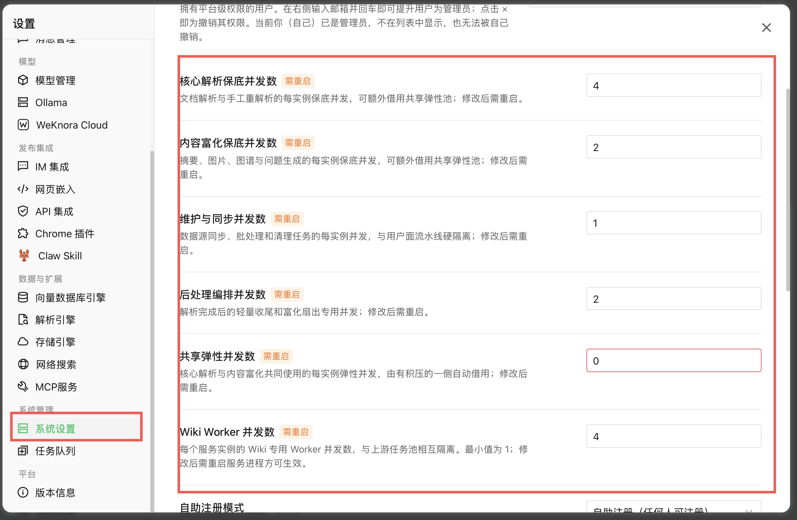
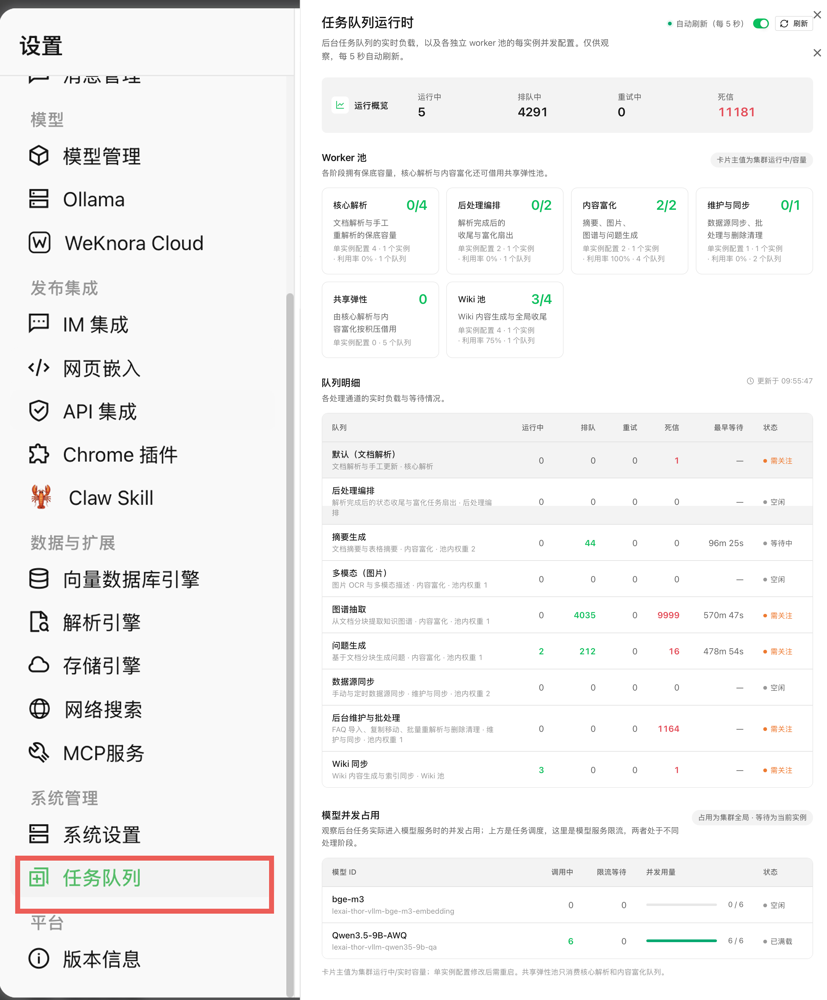

# LexAI 并发和队列配置

本文说明 ictrek 部署模板里的并发配置。实际部署时，把这些值写到目标机 env 文件：`.env`、`.env.tc232` 或 `.env.thor`。

## 三层控制

并发不是一个参数控制完的，至少分三层：

| 层级 | 作用 | 主要变量 |
| --- | --- | --- |
| Asynq 后台任务池 | 控制 core/postprocess/enrichment/maintenance/shared 五个后台 worker 池和独立 Wiki worker 池。文字解析在 core 池，轻量扇出在 postprocess 池，VLM/Graph/Question/Summary 在 enrichment 池，数据库维护和批处理在 maintenance 池。shared 是可选弹性池。 | `WEKNORA_ASYNQ_CORE_CONCURRENCY`、`WEKNORA_ASYNQ_POSTPROCESS_CONCURRENCY`、`WEKNORA_ASYNQ_ENRICHMENT_CONCURRENCY`、`WEKNORA_ASYNQ_MAINTENANCE_CONCURRENCY`、`WEKNORA_ASYNQ_SHARED_CONCURRENCY`、`WEKNORA_WIKI_ASYNQ_CONCURRENCY` |
| 后台模型总并发 | 对 Graph、Wiki、摘要、问题生成和 VLM 的模型调用做统一上限，避免独立 worker 池合计超过聊天预留。 | `WEKNORA_MODEL_MAX_CONCURRENCY` |
| 后台 LLM 限流 | 防止 Graph、Wiki、自动问题生成把主 QA 模型并发吃满。 | `WEKNORA_MAIN_QA_MODEL_CONCURRENCY`、`WEKNORA_CHAT_RESERVED_CONCURRENCY`、`WEKNORA_GRAPH_LLM_CONCURRENCY`、`WEKNORA_WIKI_INGEST_*` |
| 模型服务容量 | 控制 vLLM、Ollama 或其他 OpenAI-compatible 服务实际能同时处理多少请求。 | `VLLM_MAX_NUM_SEQS`、`BGE_VLLM_MAX_NUM_SEQS`、`CONCURRENCY_POOL_SIZE`、`BATCH_EMBED_SIZE`、`OLLAMA_NUM_PARALLEL` |

队列权重不是硬性的模型并发预留。真正给聊天保留模型槽位的是后台 LLM 限流。

## 管理界面参数和 env 对照

管理员界面的「系统设置」会展示后台 worker 池的每实例并发数。这些值保存后需要重启 app 才会生效；部署时应优先写入 env 或 compose，界面只用于运行期确认和少量调参。



| 界面参数 | env 变量 | 影响阶段 | 主要资源 | 设置建议 |
| --- | --- | --- | --- | --- |
| 核心解析保底并发数 | `WEKNORA_ASYNQ_CORE_CONCURRENCY` | 文档解析、手工重解析、分块、向量化 | docreader、Embedding、数据库写入 | 优先保证足够。新上传文档长时间不能检索时先看它；但不要超过 Embedding 服务和数据库能承受的写入能力。 |
| 内容富化保底并发数 | `WEKNORA_ASYNQ_ENRICHMENT_CONCURRENCY` | 摘要、多模态、图谱、问题生成 | 主 QA/VLM 模型、数据库写入 | 小机器保持低值。它只决定任务 worker 数，真正进入主 QA 模型还会受 `WEKNORA_MODEL_MAX_CONCURRENCY` 限制。 |
| 维护与同步并发数 | `WEKNORA_ASYNQ_MAINTENANCE_CONCURRENCY` | 数据源同步、批量重解析、批量删除、清理任务 | 数据库、对象存储、队列 | 通常为 `1`。维护任务不能抢占文字解析和聊天资源。 |
| 后处理编排并发数 | `WEKNORA_ASYNQ_POSTPROCESS_CONCURRENCY` | 文字解析完成后的状态收尾、富化任务派发 | 数据库、队列 | 不能为 `0`。它太低会让文档卡在已解析但后续任务未派发；太高通常收益不大。 |
| 共享弹性并发数 | `WEKNORA_ASYNQ_SHARED_CONCURRENCY` | 可弹性订阅 default/summary/multimodal/graph/question | 取决于借用到的队列 | 小机器建议 `0`。只有在模型和数据库余量明确充足时才设为 `1+`，否则富化任务可能绕过保底池设计。 |
| Wiki Worker 并发数 | `WEKNORA_WIKI_ASYNQ_CONCURRENCY` | Wiki 内容生成、索引同步、全局收尾 | 主 QA 模型、数据库 | Wiki 独立池，不占 core；但调用主 QA 模型时仍受 `WEKNORA_MODEL_MAX_CONCURRENCY` 约束。 |

这些 worker 参数只控制“有多少后台任务开始执行”，不等于“有多少请求可以进入模型”。如果内容富化、Wiki、图谱、摘要同时触发，最终还要经过后台主模型闸门：

```dotenv
WEKNORA_MAIN_QA_MODEL_CONCURRENCY=20
WEKNORA_CHAT_RESERVED_CONCURRENCY=6
WEKNORA_MODEL_MAX_CONCURRENCY=14
WEKNORA_GRAPH_LLM_CONCURRENCY=2
WEKNORA_WIKI_INGEST_MAP_PARALLEL=4
WEKNORA_WIKI_INGEST_REDUCE_PARALLEL=4
```

参数含义：

- `WEKNORA_MAIN_QA_MODEL_CONCURRENCY`：LexAI 认为主 QA 模型服务可接收的总请求入口，vLLM 场景通常与 `VLLM_MAX_NUM_SEQS` 对齐。
- `WEKNORA_CHAT_RESERVED_CONCURRENCY`：给在线聊天保留的目标槽位。它不是 vLLM 的独立队列，而是应用侧限制后台任务不要占满主模型。
- `WEKNORA_MODEL_MAX_CONCURRENCY`：全部后台任务同时进入主 QA 模型的硬上限，包括 Graph、Wiki、摘要、问题生成和需要主 QA 的 VLM。它应小于等于 `主模型容量 - 聊天保留`。
- `WEKNORA_GRAPH_LLM_CONCURRENCY`：单个文档内 Graph chunk 并发。它只限制 Graph 自己，仍受 `WEKNORA_MODEL_MAX_CONCURRENCY` 总闸门约束。
- `WEKNORA_WIKI_INGEST_MAP_PARALLEL` / `WEKNORA_WIKI_INGEST_REDUCE_PARALLEL`：Wiki map/reduce 阶段的并行度。知识库级配置可以覆盖 env 默认值。

任务队列页用于确认这些设置是否真的按预期运行：



上半部分的「运行概览」是全局任务数量：

- 运行中：已经被 worker 取走并正在执行的任务。
- 排队中：等待 worker 的任务。排队多不一定异常，要看是哪类队列。
- 重试中：失败后等待下一次重试的任务。
- 死信：超过重试次数的任务，需要人工检查或重新触发。

「Worker 池」卡片里的 `运行中/容量` 只代表任务池占用，不代表模型服务占用。例如「内容富化 2/2」表示两个富化 worker 都在工作，但它们是否同时进入 QA 模型，还取决于 `WEKNORA_MODEL_MAX_CONCURRENCY`。底部「模型并发占用」才是观察模型服务限流的地方：`调用中` 表示已经进入模型，`限流等待` 表示被应用侧模型闸门挡住，`并发用量` 表示当前模型槽位使用比例。

队列明细的读取方法：

- 默认（文档解析）排队高：文字解析、分块或向量化跟不上；先检查 core worker、docreader、Embedding 服务和数据库。
- 摘要生成、多模态、图谱抽取、问题生成排队高：内容富化慢；只要聊天和文字解析正常，可以让它慢慢跑。
- Wiki 同步排队高：Wiki 独立池忙；先看 Wiki worker，再看主 QA 模型是否有等待。
- 死信增长：不是单纯并发问题，需要看任务错误、Trace 和容器日志。

调参顺序：

1. 先保证在线聊天：确认 `WEKNORA_CHAT_RESERVED_CONCURRENCY` 和 `WEKNORA_MODEL_MAX_CONCURRENCY` 没让后台任务吃满主 QA 模型。
2. 再保证文字入库：提高或恢复 `WEKNORA_ASYNQ_CORE_CONCURRENCY`，确认 Embedding 有余量。
3. 最后调富化：在聊天和文字解析稳定后，再逐步提高 enrichment、wiki、graph 或 shared。
4. 每次改 worker 池后重启 app；每次改 vLLM 模型容量后重启对应模型服务，并同步更新应用侧并发。

## Thor 当前参数：每个数字限制什么

Thor 不是只靠一个并发参数。下表是 `tc97` / `192.168.1.97` 当前推荐分工，避免把 worker 数、vLLM 接收上限和后台模型限流混为一谈。该机器是 Jetson Thor M114/T5000，128G 统一内存；当前试运行 qwen `0.65/65536/20` 与 bge `0.1/8192/16`，并给系统和 LexAI 其他服务保留余量。

| 配置 | 当前值 | 实际限制对象 | 不限制什么 | 设置目的 |
| --- | ---: | --- | --- | --- |
| `VLLM_MAX_MODEL_LEN` / `WEKNORA_CHAT_MODEL_CONTEXT_TOKENS` | `65536` | QA vLLM 和应用侧 RAG prompt 的总上下文窗口 | 模型服务并发 | 两处必须严格相同；应用按输出预算和安全余量裁剪检索内容，避免 vLLM 返回 context-length 400。 |
| `WEKNORA_CONVERSATION_MAX_COMPLETION_TOKENS` | `24576` | 普通知识库问答的最大输出 token | vLLM KV cache 容量、后台 worker 数 | 普通 RAG prompt 按 `上下文 - 输出 - 安全余量` 裁剪检索内容；在 64k 窗口下约留 40k 输入。 |
| `WEKNORA_AGENT_FINAL_ANSWER_MAX_TOKENS` | `24576` | 智能体最终答案合成的最大输出 token | 中间工具调用轮次、检索结果数量 | 最终答案会按该值预留输出，并裁剪过长工具结果；避免合同审查长答案被固定 2048 截断。 |
| `WEKNORA_CHAT_CONTEXT_SAFETY_TOKENS` | `768` | prompt 预算安全余量 | 模型服务并发 | 给 tokenizer 估算误差、系统提示和模板差异留空间；64k/24k 输出时输入预算约为 `65536 - 24576 - 768 = 40192`。 |
| `VLLM_MAX_NUM_SEQS` / `WEKNORA_MAIN_QA_MODEL_CONCURRENCY` | `20` | QA vLLM 最多可接收的序列数、LexAI 主模型请求入口 | 满上下文下实际可长期并行的请求数 | `20` 是 tc97 当前服务请求上限；应用侧主模型入口必须与它一致。 |
| `WEKNORA_CHAT_RESERVED_CONCURRENCY` | `6` | LexAI 为在线聊天保留的目标容量 | Embedding 服务、文字解析 worker | 后台 LLM 任务不能把 QA 模型全部占满；这是应用侧规则，不是 vLLM 的物理隔离。 |
| `WEKNORA_MODEL_MAX_CONCURRENCY` | `14` | **全部后台任务同时进入主 QA 模型的总数**：Graph、Wiki、摘要、自动问题、需要主 QA 的 VLM | 在线聊天、bge-m3 embedding、文字解析/分块/向量化 worker | 让后台任务最多使用 20 个主模型请求槽中的 14 个，另外 6 个保留给聊天。 |
| `WEKNORA_GRAPH_LLM_CONCURRENCY` | `2` | 单个文档内 Graph chunk 的 LLM 并发 | 其他类型任务、在线聊天 | 防止一个 Graph 任务自己拆出过多并行 LLM 请求；仍受上面的全局 `WEKNORA_MODEL_MAX_CONCURRENCY=14` 约束。 |
| `WEKNORA_ASYNQ_CORE_CONCURRENCY` / `POSTPROCESS` / `ENRICHMENT` / `MAINTENANCE` / `SHARED` | `4 / 2 / 2 / 1 / 0` | 各后台 worker 池的进程内并发 | 主 QA 模型请求数 | core 保证文字解析；postprocess 保证解析后的轻量扇出；enrichment 承载 VLM/Graph/Question/Summary；Thor 关闭 shared，避免弹性池绕过分工。 |
| `WEKNORA_WIKI_ASYNQ_CONCURRENCY` | `4` | Wiki worker 数 | 主 QA 模型请求数 | Wiki 排队、准备和落库可并行；真正调用主 QA 时仍受 `WEKNORA_MODEL_MAX_CONCURRENCY=14` 限制。 |
| `BGE_VLLM_MAX_NUM_SEQS` / `CONCURRENCY_POOL_SIZE` | `16` / `8` | bge-m3 服务并发 / 文档 embedding 请求并发 | QA vLLM 槽位 | 文档入库最多使用 8 个 embedding 请求，给在线检索保留余量。 |

因此，`WEKNORA_MODEL_MAX_CONCURRENCY=14` 的目的不是降低聊天并发，而是把后台对 **同一个 QA vLLM** 的长请求限制在非聊天半区。聊天请求不经过这个后台闸门；文字解析、分块和 embedding 也不经过它。它是应用侧保护，仍要用 vLLM `waiting` 指标、TTFT 和输出速度回验；如果聊天时持续出现 `waiting > 0`，应继续降低后台模型负载、Graph/Wiki/VLM 并发或上下文，而不是提高 worker 数。

### 回答长度和上下文预算

回答长度不是一个单独旋钮，它会同时影响输入检索预算和 vLLM KV cache 压力。当前有三类相关设置：

| 设置位置 | 参数 | 作用范围 | 当前 tc97 值 | 说明 |
| --- | --- | --- | ---: | --- |
| 智能体界面 | Max completion tokens / `agent.config.max_completion_tokens` | 单个快速问答智能体 | 可在界面设置 | 在「智能体 / 模型配置」里调整，只影响该智能体的普通问答输出；不是全局部署默认值。 |
| 部署环境变量 | `WEKNORA_CONVERSATION_MAX_COMPLETION_TOKENS` | 普通知识库问答默认输出预算 | `24576` | 当请求没有更高的智能体级输出配置时使用；应用会按该值为回答预留 token。 |
| 部署环境变量 | `WEKNORA_AGENT_FINAL_ANSWER_MAX_TOKENS` | 智能推理 / Skill 最终答案 | `24576` | 用于合同审查等长报告的最终合成；目前不是界面全局设置，需要改 `.env`/compose 并重启 app。 |
| 部署环境变量 | `WEKNORA_CHAT_MODEL_CONTEXT_TOKENS` | 应用侧模型上下文窗口 | `65536` | 必须等于 QA vLLM `--max-model-len`。 |
| 部署环境变量 | `WEKNORA_CHAT_CONTEXT_SAFETY_TOKENS` | 安全余量 | `768` | 防止 tokenizer 估算、模板和系统消息差异导致超过 vLLM 硬限制。 |

预算关系：

```text
可用于检索上下文或工具结果的输入预算
= WEKNORA_CHAT_MODEL_CONTEXT_TOKENS
  - max(本次请求输出 token, 部署默认输出 token)
  - WEKNORA_CHAT_CONTEXT_SAFETY_TOKENS
```

tc97 当前约为：

```text
65536 - 24576 - 768 = 40192
```

这表示普通 RAG 检索内容、引用片段和智能体工具结果会在进入模型前被裁剪到约 40k 输入预算内。这样做的目标是避免短问题也因为检索到了过多长文档而触发 `maximum context length` 400。

设置规则：

1. 要长答案，先确认 vLLM 和应用侧上下文都已经同步放大。只提高输出 token，会压缩输入检索预算。
2. 要更多引用和更长输入，先降低输出上限或提高模型上下文。合同审查报告可保留较高输出；普通法规问答通常不需要 24k。
3. 界面里的智能体 Max completion tokens 适合调整单个快速问答智能体；部署 env 适合设定整套系统的默认上限和智能推理最终答案上限。
4. `WEKNORA_AGENT_FINAL_ANSWER_MAX_TOKENS` 主要影响智能推理最后一步，不直接增加中间工具调用次数；中间工具结果过长时仍会被裁剪。
5. 每次改这些值后，必须检查 app 容器实际 env、vLLM `/v1/models` 的 `max_model_len`、以及聊天是否还有 `maximum context length` 报错。

## 机器资源评估流程

给一台新机器定模型、上下文、模型并发和聊天预留时，按下面顺序做，不要只按显存大小或 `max-num-seqs` 猜。

1. 先定在线体验目标。明确是否必须跑 VLM/Graph/Wiki、是否需要 16k 以上上下文、是否要在文档入库时还能稳定聊天。聊天必须最高优先级时，先预留 `2-3` 个主 QA 槽；多人同时使用再继续提高。
2. 选候选模型。优先用目标硬件已经验证能稳定启动的量化模型；同等效果下先选更小模型或更低显存量化。模型启动后显存不能长期贴近上限，至少留出 KV cache、embedding、数据库和系统余量。
3. 定上下文。上下文越大，KV cache 越多，满长并发越低。小机器先用业务必须值，例如 16k、18k、20k；tc97 这类 96GB+ Thor 可以试 32k、48k、64k，但必须同步 `VLLM_MAX_MODEL_LEN`、`WEKNORA_CHAT_MODEL_CONTEXT_TOKENS` 和输出预算。若聊天或 Graph 变慢，先降低后台主模型并发、Graph/Wiki/VLM 并发或上下文，不要抢聊天预留。
4. 启动 vLLM 做实测。先设置保守 `--gpu-memory-utilization`，再设置 `--max-model-len` 和候选 `--max-num-seqs`。启动日志里的这一行是关键依据：

```text
Maximum concurrency for 32,768 tokens per request: <n>x
```

这个数只表示满长请求下的 KV cache 可容纳序列数，不代表这些请求都能流畅回答。`VLLM_MAX_NUM_SEQS` 和 `WEKNORA_MAIN_QA_MODEL_CONCURRENCY` 不能超过服务实际配置；如果启动日志里的有效 KV 并发低于服务请求上限，后台主模型并发必须按这个实测值扣除聊天预留。tc97 当前按请求上限分配：20 个主模型入口、6 个聊天保留、14 个后台主模型槽，并用 `waiting`、TTFT 和输出吞吐继续回验。

5. 定 LexAI 应用侧并发。推荐公式：

```text
WEKNORA_MAIN_QA_MODEL_CONCURRENCY = VLLM_MAX_NUM_SEQS
WEKNORA_CHAT_RESERVED_CONCURRENCY = 按在线体验目标设置，单人至少 2-3，tc97 当前为 6
WEKNORA_MODEL_MAX_CONCURRENCY = max(1, min(VLLM_MAX_NUM_SEQS, floor(vLLM 满长有效并发)) - WEKNORA_CHAT_RESERVED_CONCURRENCY)
```

如果 `background_llm_slots < 1`，说明模型/上下文/显存组合不足以同时跑后台增强和聊天，应降低上下文、换小模型，或关闭/降低 Graph、Wiki、VLM 后台任务。

6. 定 Embedding 并发。Embedding 模型最好独立服务。`BGE_VLLM_MAX_NUM_SEQS` 是服务侧上限，`CONCURRENCY_POOL_SIZE` 是文档 embedding 应用侧上限；如果希望聊天检索保留 3 个槽，就让 `CONCURRENCY_POOL_SIZE <= BGE_VLLM_MAX_NUM_SEQS - 3`。

7. 用线上指标回验。文档入库时看：

```bash
curl -sS http://127.0.0.1:32222/metrics \
  | grep -E 'vllm:num_requests_(running|waiting)'
docker logs --tail 50 qwen35-9b-vllm 2>&1 \
  | grep -E 'Running:|Waiting:|GPU KV cache usage'
```

如果没有聊天时 qwen `Running` 长期等于或高于 `WEKNORA_MAIN_QA_MODEL_CONCURRENCY - WEKNORA_CHAT_RESERVED_CONCURRENCY`，这是正常后台占用；如果聊天时 `Waiting > 0` 持续出现，优先降低后台槽、Graph/Wiki/VLM 并发或上下文。不要用提高 Asynq worker 数解决模型排队。

## 按显存选择起始配置

下表是新机器第一次部署时的起始值，不是最终值。最终值必须按上一节的 vLLM 启动日志和 `/metrics` 回验。显存只决定大致模型档位；同样显存下，模型量化方式、上下文长度、`gpu-memory-utilization`、是否同机跑 Embedding/VLM、系统保留都会改变可用并发。

| 可用显存 | 主 QA 模型建议 | 上下文起点 | `VLLM_MAX_NUM_SEQS` 起点 | 聊天保留 | 后台 worker 池起点 | Graph/Wiki 建议 | 适用场景 |
| --- | --- | ---: | ---: | ---: | ---: | --- | --- |
| 8-12GB | 3B-4B 量化，或只接远端 LLM | 8k-12k | 2-3 | 1 | 1 | 默认关闭，必要时手动低峰跑 | 轻量问答、少量文档入库。 |
| 16-24GB | 7B-9B AWQ/GPTQ/INT4 | 12k-16k | 4-5 | 2 | 2-3 | Graph 1，Wiki 1/1；多模态谨慎开启 | 单人或小团队，后台增强不能抢聊天。 |
| 32-48GB | 9B-14B 量化，或 7B FP16 | 16k-20k | 6-8 | 2-3 | `主模型并发 - 聊天保留`，通常 3-5 | Graph 1-2，Wiki 1-2/1-2；VLM 排在文字解析之后 | 可同时入库和问答，但仍要限制 Graph/Wiki。 |
| 64-80GB | 14B-32B 量化，或 9B/14B 更长上下文 | 20k-32k | 8-12 | 3-4 | `主模型并发 - 聊天保留`，通常 5-8 | 可适度提高 Graph/Wiki，但仍低于 parse/multimodal 优先级 | 多用户或较重后台解析。 |
| 96GB+ | 32B-70B 量化，或多模型拆分 | 32k 起按业务测试 | 12+，以满长有效并发为准 | 4+ | 按实际后台余量设置，不要超过模型剩余槽位 | 建议拆分 QA、Embedding、Graph/Wiki 模型服务 | 重负载、多团队、可做独立服务隔离。 |

具体落地规则：

1. `WEKNORA_MAIN_QA_MODEL_CONCURRENCY` 可以对齐 `VLLM_MAX_NUM_SEQS`，表示服务侧请求上限；`WEKNORA_MODEL_MAX_CONCURRENCY` 才是后台任务进入主模型的上限，必须按 vLLM 日志里的满长有效并发扣除聊天预留。
2. `WEKNORA_CHAT_RESERVED_CONCURRENCY` 先按 2-3 配，机器越小越不能降到 0；聊天慢时先提高保留并降低后台 worker。
3. 旧的 `WEKNORA_ASYNQ_CONCURRENCY` 已退休；现在必须显式设置 core/postprocess/enrichment/maintenance/shared/wiki。tc97 Thor 使用 `4/2/2/1/0/4`，其中 `shared=0` 表示禁用弹性借用，避免后台增强绕过明确的池容量限制。
4. 文字解析、分块、向量化在 core 池，优先于 VLM/Graph/Wiki 后台增强。Graph/Wiki 作为增强慢慢补，不能为了 Graph/Wiki 提高到影响聊天。
5. 新机器初次部署时，先关闭或压低 Graph/Wiki，确认聊天和文字解析稳定后，再逐步打开。

## 主 QA/LLM 并发

对话、Graph 抽取、Wiki 生成、自动问题生成可能共用同一个主 QA/LLM 模型。部署时按模型服务真实容量配置：

```dotenv
WEKNORA_MAIN_QA_MODEL_CONCURRENCY=20
WEKNORA_CHAT_RESERVED_CONCURRENCY=6
WEKNORA_MODEL_MAX_CONCURRENCY=14
WEKNORA_GRAPH_LLM_CONCURRENCY=2
WEKNORA_CHAT_MODEL_CONTEXT_TOKENS=65536
WEKNORA_CHAT_CONTEXT_SAFETY_TOKENS=768
WEKNORA_CONVERSATION_MAX_COMPLETION_TOKENS=24576
WEKNORA_AGENT_FINAL_ANSWER_MAX_TOKENS=24576
WEKNORA_WIKI_INGEST_MAP_PARALLEL=4
WEKNORA_WIKI_INGEST_REDUCE_PARALLEL=4
```

`WEKNORA_MAIN_QA_MODEL_CONCURRENCY` 是主 QA 模型服务允许接收的请求数上限。vLLM 场景下，它可以和 `VLLM_MAX_NUM_SEQS` 保持一致，但不能把这个值直接当成满上下文真实并发。

每次调整上下文、显存占用率、模型或量化方式后，都要看 vLLM 启动日志中的实测值：

```text
Maximum concurrency for <context> tokens per request: <n>x
```

`WEKNORA_MODEL_MAX_CONCURRENCY` 是**后台主模型的硬闸门**，不是 `VLLM_MAX_NUM_SEQS` 的别名。它应先按 `min(VLLM_MAX_NUM_SEQS, floor(<n>)) - WEKNORA_CHAT_RESERVED_CONCURRENCY` 估算，再以聊天期间的 vLLM `waiting`、TTFT 和输出吞吐回验。tc97 当前在 `65536` 上下文、qwen `gpu_memory_utilization=0.65`、`VLLM_MAX_NUM_SEQS=20` 下按 20 个服务请求槽分配：6 个聊天保留，后台主模型最多 14 个。

`WEKNORA_CHAT_MODEL_CONTEXT_TOKENS` 必须和 vLLM `--max-model-len` 一致；应用会按 `上下文窗口 - 输出 token - WEKNORA_CHAT_CONTEXT_SAFETY_TOKENS` 裁剪 RAG 检索上下文，避免检索内容把 prompt 顶到模型硬限制。tc97 当前 `65536/24576/768` 对应输入预算约 `40192` token；如果 64k 在实际聊天压测中出现 `waiting` 或 TTFT 明显升高，可先把 `VLLM_GPU_MEMORY_UTILIZATION` 提到 `0.7-0.75` 复测。若仍不稳定，再统一降为 `VLLM_MAX_MODEL_LEN=49152`、`WEKNORA_CHAT_MODEL_CONTEXT_TOKENS=49152`、输出 `16384`，输入预算约 `49152 - 16384 - 768 = 32000`。

`WEKNORA_CHAT_RESERVED_CONCURRENCY` 是给在线聊天保留的目标并发，不让后台 LLM 任务占用。它是 LexAI 应用侧的后台 LLM 限流，不是 vLLM 自带的硬隔离；所有文档后处理、Graph、Wiki、自动问题生成等后台 LLM 调用都必须走 `acquireBackgroundLLMSlot`，否则会绕过预留直接占满模型服务。下面的值仅表示**入口调度差值**，不能替代 vLLM 满上下文实测值，也不能替代 `WEKNORA_MODEL_MAX_CONCURRENCY`：

```text
background_llm_slots = WEKNORA_MAIN_QA_MODEL_CONCURRENCY - WEKNORA_CHAT_RESERVED_CONCURRENCY
```

如果两个值都大于 0，且 `main <= reserved`，LexAI 仍会保留 1 个后台槽位，避免 Graph/Wiki/Question 完全不执行。如果任意一个值为空或为 `0`，后台 LLM 限流不会启用。tc97 的最终后台上限仍以 `WEKNORA_MODEL_MAX_CONCURRENCY=14` 为准。

`WEKNORA_GRAPH_LLM_CONCURRENCY` 限制单个文档 Graph 抽取中的 LLM 并发。

`WEKNORA_WIKI_INGEST_MAP_PARALLEL` 和 `WEKNORA_WIKI_INGEST_REDUCE_PARALLEL` 限制 Wiki map/reduce 阶段的 LLM 并发。知识库级别的 `wiki_config.ingest_map_parallel` 或 `wiki_config.ingest_reduce_parallel` 会覆盖 env 默认值。

## Asynq worker 池

后台任务 worker 通过 env 控制：

```dotenv
WEKNORA_ASYNQ_CORE_CONCURRENCY=4
WEKNORA_ASYNQ_POSTPROCESS_CONCURRENCY=2
WEKNORA_ASYNQ_ENRICHMENT_CONCURRENCY=2
WEKNORA_ASYNQ_MAINTENANCE_CONCURRENCY=1
WEKNORA_ASYNQ_SHARED_CONCURRENCY=0
WEKNORA_WIKI_ASYNQ_CONCURRENCY=4
WEKNORA_MODEL_MAX_CONCURRENCY=14
```

`WEKNORA_ASYNQ_*_CONCURRENCY` 不是一个总并发变量，而是每个 worker 池的显式容量。旧的 `WEKNORA_ASYNQ_CONCURRENCY` 不再写入 ictrek 模板。

| worker 池 | Thor 并发 | 队列/任务 | 作用 |
| --- | ---: | --- | --- |
| core | 4 | `default`: `document:process`、`manual:process` | 文档解析、分块、向量化，优先保证新文档先可检索。 |
| postprocess | 2 | `postprocess`: `knowledge:post_process` | 文字解析完成后的轻量扇出，避免被长时间文档解析阻塞。 |
| enrichment | 2 | `summary`、`multimodal`、`graph`、`question` | 摘要、VLM/OCR、Graph、自动问题等后台增强。 |
| maintenance | 1 | `sync`、`low` | 数据源同步、批量删除、批量重解析、索引删除等维护任务。 |
| shared | 0 | 可弹性订阅 `default`、`summary`、`multimodal`、`graph`、`question` | Thor 关闭该池；大显存机器可设为 1+，让 core/enrichment 在空闲时借用容量。 |
| wiki | 4 | `wiki` | 独立 Wiki ingest/finalize，由 `WEKNORA_WIKI_ASYNQ_CONCURRENCY` 控制。 |

旧的 `WEKNORA_ASYNQ_QUEUE_PARSE`、`WEKNORA_ASYNQ_QUEUE_MULTIMODAL`、`WEKNORA_ASYNQ_QUEUE_GRAPH`、`WEKNORA_ASYNQ_QUEUE_QUESTION` 已不再是部署模板配置项，不要继续写进 env 或 compose。队列和 worker 池以代码中的 `types.QueueDefinitions()` 为准。

`WEKNORA_ASYNQ_*_CONCURRENCY` 不等同于主 QA 模型并发。tc97 Thor 的后台池为 `core=4 / postprocess=2 / enrichment=2 / maintenance=1 / shared=0`，让文字解析和 embedding 继续推进，同时由 `WEKNORA_MODEL_MAX_CONCURRENCY=14` 统一限制 Graph/VLM/Summary/Question/Wiki 等后台主模型请求。

Wiki 使用独立 worker 池后，五个 `WEKNORA_ASYNQ_*_CONCURRENCY` 与 `WEKNORA_WIKI_ASYNQ_CONCURRENCY` 不再互相包含。真正保护聊天的是 `WEKNORA_MODEL_MAX_CONCURRENCY`：它限制 Graph、Wiki、摘要、问题生成、VLM 等后台任务同时进入主 QA 模型的数量。

不要只用 `VLLM_MAX_NUM_SEQS - WEKNORA_CHAT_RESERVED_CONCURRENCY` 计算后台模型并发。vLLM 在启动日志里会输出当前上下文下的 KV cache 可容纳序列数，例如：

```text
Maximum concurrency for 32,768 tokens per request: <n>x
```

这个数只证明 KV cache 可放下多少满长序列，不证明它们都能流畅问答。为了给聊天保留 6 个可用槽位，tc97 当前在 `VLLM_MAX_NUM_SEQS=20` 下把后台主模型并发设为 `14`。如果另一台 Thor 或另一套模型的启动日志低于 `VLLM_MAX_NUM_SEQS`，必须按较小值重新计算，不能照抄 tc97。

在线 QA 不走 Asynq 后台队列；它的优先级由 IM/HTTP 请求路径、`WEKNORA_CHAT_RESERVED_CONCURRENCY` 和 prompt 预算保证。文档入库主解析走 core 池，确保新上传文档先完成文字解析、分块、向量化和可检索状态；VLM/OCR、Graph、摘要和自动问题生成走 enrichment 池；Wiki ingest 走独立 wiki 池。后台增强再多，也必须经过 `WEKNORA_MODEL_MAX_CONCURRENCY`，不能绕过聊天预留。

部署模板默认设置 `WEKNORA_REPARSE_INCOMPLETE_ON_START=true`。app 重建或重启后，会先等待 `WEKNORA_REPARSE_WAIT_URLS` 中的模型服务 ready，再把具备可解析来源的 `failed`、`pending` 状态知识重新提交到批量重解析任务；`processing` 和 `finalizing` 只有在 `processed_at is null` 且具备可解析来源时才会整篇重解析。可解析来源指上传文件有 `file_path`，`file_url` / `url` 有 `source`，手工知识有非空 `metadata.content`。已经完成文字解析和向量入库、只是停在 VLM/Graph/Wiki 后台增强的文档不会被整篇重跑；没有任何可解析来源的空记录也不会被提交，避免重复 docreader、分块和 embedding，或制造永远无法执行的 pending 任务。每条知识真正重新解析前会先清理该知识残留的 queued/retry 任务，再提交新的 `document:process` 到 core 池。所以它仍然优先于 VLM、Graph、Wiki 后台增强，但不会改变在线 QA 的最高优先级。

启动扫描还会按知识库当前配置清理已关闭功能的后台任务：如果知识库关闭了多模态识别，会删除/取消该知识库未完成的 VLM/OCR 多模态任务；如果关闭了知识图谱，会删除/取消未完成的 Graph 抽取任务。已经完成的识别和图谱结果保留。以后重新打开多模态识别时，app 会自动检查该知识库中已经完成文字解析、但最新 attempt 的 `multimodal` 阶段为 `skipped`、`cancelled` 或 `failed` 的文档，从文本 chunk 里的图片链接补发 `image:multimodal` 任务，不重跑全文解析。Housekeeping 判断队列保护时同时匹配 `knowledge_id` 和 latest `attempt`：当前 attempt 的排队/运行任务会被保留，旧 attempt 或没有当前 attempt 的旧格式任务不会让文档长期卡在 `finalizing`。Graph 重新打开后仍按重新解析或后续专门恢复入口补跑。

小机器上不要通过提高 worker 数来催 Graph/Wiki。聊天请求本身不走后台队列，但后台任务仍可能竞争同一个 LLM 或 Embedding 模型服务。

## Embedding 并发

文档向量化主要看这几个参数：

```dotenv
BATCH_EMBED_SIZE=8
CONCURRENCY_POOL_SIZE=8
BGE_VLLM_MAX_NUM_SEQS=16
```

`BATCH_EMBED_SIZE` 是单次 embedding 请求里打包的 chunk 数。

`CONCURRENCY_POOL_SIZE` 是应用侧文档 embedding 请求并发上限。它如果低于文档 worker 数，后台解析可能看起来卡在 embedding 阶段。

`BGE_VLLM_MAX_NUM_SEQS` 是 bge-m3 vLLM 服务的序列并发。想给聊天检索保留余量时，应让文档 embedding 的应用侧并发低于这个值，或单独降低后台解析 worker 数。

如果使用 Ollama 作为 Embedding 备用路径，`OLLAMA_NUM_PARALLEL` 控制 Ollama 侧请求并发。Thor 默认 Embedding 是 vLLM bge-m3，Ollama bge-m3 只作为备用，不作为常驻主路径。

## 推荐值

| 机器类型 | LLM 服务并发 | 聊天保留 | 后台 worker 池 | 后台主模型并发 | Graph LLM | Wiki map/reduce | 说明 |
| --- | ---: | ---: | --- | ---: | ---: | ---: | --- |
| Thor M114/T5000 `192.168.1.97` | 20 | 6 | core=4 / postprocess=2 / enrichment=2 / maintenance=1 / shared=0 / wiki=4 | 14 | 2 | 4 / 4 | QA/Graph/Wiki/Question 共用 9B vLLM，`VLLM_MAX_MODEL_LEN=65536`，qwen `gpu_memory_utilization=0.65`，bge `gpu_memory_utilization=0.1`。普通问答和智能体最终答案输出上限为 24576，输入预算约 40192；后台主模型并发按 `20 - 6 = 14` 配，仍要看 `waiting`、TTFT 和输出吞吐。 |
| tc232 9B vLLM | 6 | 2 | core=2 / postprocess=1 / enrichment=2 / maintenance=1 / shared=1 / wiki=2 | 2-4，按 vLLM 实测下调 | 2 | 2 / 2 | 按 tc232 当前 6 并发模型容量保留 2 个聊天槽位；若聊天慢，先降后台模型并发和 shared/enrichment。 |
| 通用 4 并发主机 | 4 | 1 | core=2 / postprocess=1 / enrichment=1 / maintenance=1 / shared=0 / wiki=1 | 1 | 1 | 1 / 1 | 优先降低 Wiki/Graph，不要先压缩聊天保留。 |

Thor 的 bge-m3 vLLM 推荐值：

```dotenv
BGE_VLLM_MAX_NUM_SEQS=16
WEKNORA_ASYNQ_CORE_CONCURRENCY=4
WEKNORA_ASYNQ_POSTPROCESS_CONCURRENCY=2
WEKNORA_ASYNQ_ENRICHMENT_CONCURRENCY=2
WEKNORA_ASYNQ_MAINTENANCE_CONCURRENCY=1
WEKNORA_ASYNQ_SHARED_CONCURRENCY=0
CONCURRENCY_POOL_SIZE=8
BATCH_EMBED_SIZE=8
```

这样 bge-m3 vLLM 最大 16 并发，文档 embedding 的应用侧并发最多 8，给聊天检索保留余量。如果聊天检索仍出现排队，应继续降低 `CONCURRENCY_POOL_SIZE` 或后台 worker，而不是提高 bge-m3 vLLM 到机器承受不了的并发。

## 调参判断

| 现象 | 优先调整 |
| --- | --- |
| 文档入库时聊天变慢 | 先看 vLLM 启动日志里的 `Maximum concurrency for ... tokens per request`，再看真实压测的 `waiting`、TTFT 和输出吞吐。后台主模型并发应小于等于 `min(VLLM_MAX_NUM_SEQS, 实测满长 KV 容量) - 聊天预留`，但 KV 容量不能替代流畅度测试。tc97 当前试运行 `20 - 6 = 14`；不要只看 `VLLM_MAX_NUM_SEQS`，也不要只看显存。 |
| 聊天报 `maximum context length` | 检查 `WEKNORA_CHAT_MODEL_CONTEXT_TOKENS` 是否等于 vLLM `--max-model-len`，并确认应用容器已带 `WEKNORA_CHAT_CONTEXT_SAFETY_TOKENS`。RAG 检索上下文必须在应用层裁剪，不能依赖 vLLM 报错。 |
| Graph 或 Wiki 很慢，但聊天正常 | 只有在模型服务还有余量时，才提高 `WEKNORA_GRAPH_LLM_CONCURRENCY` 或 Wiki map/reduce。 |
| 卡在 embedding 阶段 | 先检查 bge-m3 服务是否 ready，再对比 `WEKNORA_ASYNQ_*_CONCURRENCY`、`CONCURRENCY_POOL_SIZE`、`BATCH_EMBED_SIZE`、`BGE_VLLM_MAX_NUM_SEQS`。 |
| GPU 显存接近打满 | 先降低模型服务侧参数，例如 `VLLM_MAX_NUM_SEQS`、上下文长度或显存占用率，再把应用侧并发同步降下来。 |

## 现场确认

在目标机上看运行中的容器，不要只看 env 文件：

```bash
docker inspect lexai-thor-app-1 --format '{{range .Config.Env}}{{println .}}{{end}}' \
  | grep -E '^(WEKNORA_MAIN_QA_MODEL_CONCURRENCY|WEKNORA_CHAT_RESERVED_CONCURRENCY|CONCURRENCY_POOL_SIZE|BATCH_EMBED_SIZE)='

docker inspect qwen35-9b-vllm --format '{{range .Config.Cmd}}{{println .}}{{end}}' \
  | grep -E 'max-num-seqs|max-model-len|max-num-batched-tokens|gpu-memory-utilization'

curl -sS http://127.0.0.1:32222/metrics \
  | grep -E 'vllm:num_requests_(running|waiting)'
curl -sS http://127.0.0.1:32223/metrics \
  | grep -E 'vllm:num_requests_(running|waiting)'
```

tc97 当前配置下，后台主模型调用正常应长期压在 14 个以内；用户聊天同时发生时，qwen running 可以短时超过 14，但不应持续出现 `waiting > 0`。bge-m3 当前是 16 槽，文档 embedding 应用侧最多 8 个请求；如果 bge `waiting > 0`，先降 `CONCURRENCY_POOL_SIZE` 或后台 worker。

修改后要同步 env、compose 里的模型服务参数和内置模型配置。只改 env 时，重新执行对应 compose `up -d` 即可让 app 读取新值。

## 2026-07-12 变更说明

本次 Thor 配置与前端行为需要一起理解：

1. QA vLLM 上下文统一为 `65536`。`WEKNORA_CHAT_MODEL_CONTEXT_TOKENS=65536`、vLLM `--max-model-len 65536`、应用侧 prompt 安全余量 `WEKNORA_CHAT_CONTEXT_SAFETY_TOKENS=768`、普通问答输出上限 `WEKNORA_CONVERSATION_MAX_COMPLETION_TOKENS=24576`、智能体最终答案输出上限 `WEKNORA_AGENT_FINAL_ANSWER_MAX_TOKENS=24576` 必须同时生效；否则 RAG 即使问题很短，也可能因检索文本过长触发 context-length 400，或长答案仍被 2048 截断。
2. tc97 Thor 当前试运行 `VLLM_MAX_NUM_SEQS=20`、聊天预留 `6`，后台主模型调用固定为 `WEKNORA_MODEL_MAX_CONCURRENCY=14`。这不是把系统总并发降到 14，而是阻止 Graph/Wiki/摘要/VLM 占用预留给聊天的 6 个 QA vLLM 请求槽。
3. worker 池保持 core=4、postprocess=2、enrichment=2、maintenance=1、wiki=4。文字解析、分块和 embedding 优先进入 core；VLM/OCR、Graph、摘要和自动问题在 enrichment；Wiki 有独立队列，但所有需要 QA 模型的后台阶段仍经过同一个后台模型闸门。
4. 前端在流式回答期间收到历史消息刷新时，会保留正在回复行的 `id/request_id`，后续带引用的 SSE 事件仍更新同一行。这样不会因数据库消息 ID 与流式 request ID 不同而显示两条相同回答。该修复属于前端消息合并逻辑，不改变模型并发或任务队列。

部署后至少执行下面三项确认，不能只看 env 文件：

```bash
# 1) app 实际读取的限流值
docker inspect lexai-thor-app-1 --format '{{range .Config.Env}}{{println .}}{{end}}' \
  | grep -E '^(WEKNORA_MAIN_QA_MODEL_CONCURRENCY|WEKNORA_CHAT_RESERVED_CONCURRENCY|WEKNORA_MODEL_MAX_CONCURRENCY|WEKNORA_GRAPH_LLM_CONCURRENCY|WEKNORA_CHAT_MODEL_CONTEXT_TOKENS)='

# 2) QA vLLM 实际启动参数
docker inspect qwen35-9b-vllm --format '{{range .Config.Cmd}}{{println .}}{{end}}' \
  | grep -E 'max-model-len|max-num-seqs|max-num-batched-tokens|gpu-memory-utilization'

# 3) 文档后台任务运行时，聊天是否仍在排队
curl -sS http://127.0.0.1:32222/metrics \
  | grep -E 'vllm:num_requests_(running|waiting)'
```
